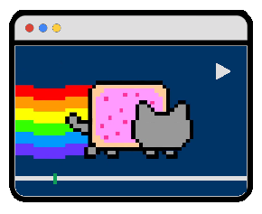
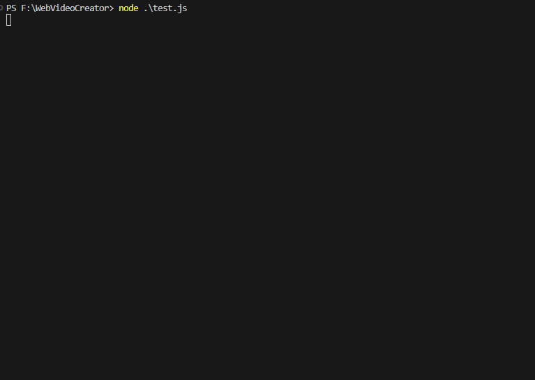
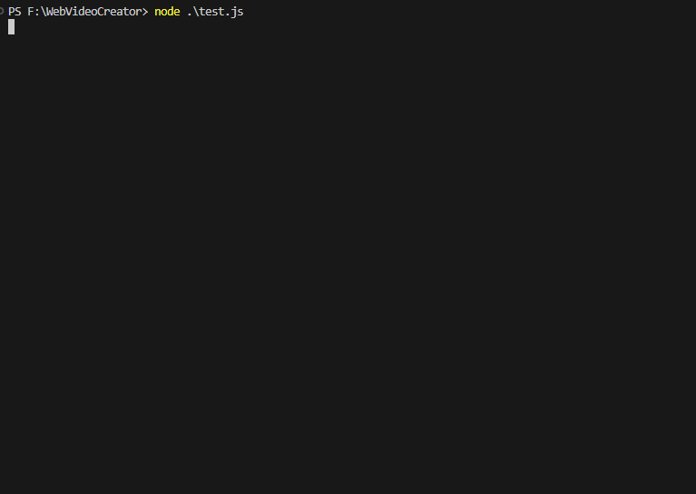

[简体中文](./README.md) | [English](./README.en-US.md)

<p align="center" style="background:#fff">
  
</p>

[](https://npmjs.org/package/web-video-creator)


# 简介

🌈 WebVideoCreator（简称WVC）是一个将Web动画渲染为视频的框架，基于 Node.js + Puppeteer + Chrome + FFmpeg 实现，它执行确定性的渲染，准确的以目标帧率捕获任何可在HTML5播放动画（CSS3动画/SVG动画/Lottie动画/GIF动画/APNG动画/WEBP动画）以及任何基于时间轴使用[RAF](https://developer.mozilla.org/zh-CN/docs/Web/API/Window/requestAnimationFrame)驱动的动画（[anime.js](https://animejs.com/)是一个不错的选择 :D），当然您也可以调皮的使用setInterval或者setTimeout来控制动画，支持导出和嵌入mp4或透明通道的webm视频，还支持转场合成、音频合成与字体加载等功能。让我们[快速开始](#快速开始) 🍻。

WVC为您酷炫的动画页面创造了一个虚拟时间环境🕒（也许可以想象成是一个《楚门的世界》），它的主要职责是将一个 [不确定性渲染的环境](./docs/renderer-env.md#不确定性的渲染环境) 转化到 [确定性渲染的环境](./docs/renderer-env.md#确定性的渲染环境)。

这一切的前提由Chrome提供的[确定性渲染模式](https://goo.gle/chrome-headless-rendering)和无头实验API支持：[HeadlessExperimental.beginFrame](https://chromedevtools.github.io/devtools-protocol/tot/HeadlessExperimental/#method-beginFrame)，这是创新的实验性功能 🧪。

答疑交流QQ群🐧：752693580

<br>

# 特性

 - 基于Node.js开发，使用非常简单，易于扩展和开发。
 - 视频处理速度非常快，最快5分钟视频可在1分钟内完成渲染，查看[性能提示](#性能提示)获得最佳性能。
 - 支持单幕和多幕视频渲染合成，多幕视频可应用[转场效果](#插入转场效果)。
 - 支持分块视频合成，可以将分块分发到多个设备上渲染回传再合成为多幕视频，大幅降低长视频渲染耗时。
 - 支持并行多个视频渲染合成任务，充分利用系统资源。
 - 支持嵌入或导出支持透明通道的webm格式视频，可以用于合成数字人。
 - API支持进行[分布式渲染](#分布式渲染方案)封装，只需对WVC进行一些封装即可将大量视频分块分发到多个设备渲染并最终取回合并输出
 - 支持使用GPU加速渲染和合成，可以显著的降低视频渲染耗时。
 - 支持在Windows和Linux平台部署运行，Mac上需要开启[兼容渲染模式](#兼容渲染模式)。

<br>

# 有什么用？

WVC实现对Web页面任意动画的逐帧完美捕获，它可以最大化降低实现所见即所得的成本，它作为渲染后端目前发掘了以下用途：

**📊 数据可视化视频渲染**：结合ECharts等图表库在Web上实现图表动画并用WVC捕获为视频，比如抖音和视频号常见的动态排行榜视频，配合爬虫采数据更佳。

**👩‍🏫 数字人视频渲染**：AIGC概念火爆，各种数字分身搬上了荧幕，WVC支持在页面中使用透明通道视频或蒙版视频，可以在动画基础上配上数字人获得更好的视觉效果。

**🎨 内容创作视频渲染**：您可以设计一个简单的前端动画编辑和预览器来满足一些内容创作需求，使用WVC作为后端获得所见即所得的视频效果。

**🎮️ 游戏或用户操作回放视频渲染**：与基于Web开发的游戏或应用结合，云上将回放捕获为视频提供给用户可方便分享和二次剪辑。

更多应用场景等待您的发掘，有好的想法记得提issue 🙋‍♀️...

## 相比录屏工具的优势？

**💯 完美捕获**：浏览器的帧合成器默认存在节流策略以减少资源消耗，当绘制大量复杂图形或系统负载加大时会导致Web动画出现跳帧、掉帧、延缓等问题，如果使用录屏工具将难以确保每一帧都被正确捕获，而WVC接管了时间流速，能够决定下一帧什么时候绘制到画面。

**🎞️ 并行渲染**：录屏工具通常无法同时捕获多个Tab页的动画内容，但WVC可以在多个页面中并行捕获动画并最终合成这些分块为一个长视频，分段直接还支持合成转场。

**🦾 可自动化**：录屏工具需要人工操作，基于WVC可以使用一套Web动画模板结合数据爬虫+定时任务，自动的产出视频。

**🧩 快速集成**：录屏工具难以集成，WVC是基于Node.js开发的NPM包，可以很快的进行后端集成，有的开发者用于将游戏回放捕获为视频。

<br>

# 视频DEMO

我们还缺少动画设计师，如果您热衷于开源事业欢迎加入我们😆。

在这里查看所有DEMO：**[渲染示例页面](https://github.com/Vinlic/WebVideoCreator/wiki/Rendering-Example)** 🤗


<br>

# 支持的动画库

理论上所有的Web动画/图形库都能够在WVC环境正常运行，以下仅列出我已验证可用的库：

[Anime.js](https://animejs.com/) / [GSAP](https://greensock.com/) / [D3.js](https://d3js.org/) / [Three.js](https://threejs.org/) / [Echart](https://echarts.apache.org/) / [Lottie-Web](http://airbnb.io/lottie/#/web) / [PixiJS](https://pixijs.download/release/docs/index.html) / [Animate.css](https://animate.style/) / [Mo.js](https://mojs.github.io/) / [Tween.js](https://tweenjs.github.io/tween.js/)

需要注意的是，如果您手动使用[RAF](https://developer.mozilla.org/zh-CN/docs/Web/API/Window/requestAnimationFrame)驱动动画，请确保从回调中接收timestamp参数设置动画的进度到该时间点，否则可能出现帧率不同步。

<br>

# 快速开始

## 安装

```shell
# 从NPM安装WebVideoCreator
npm i web-video-creator
```

如遇到ffmpeg-static下载失败，请先设置环境变量：`FFMPEG_BINARIES_URL=https://cdn.npmmirror.com/binaries/ffmpeg-static`

## 创建本地服务器

WVC需要从Web页面中捕获动画，您可以在本地创建一个临时的Web服务器来提供静态页面服务，方便接下来的测试，使用live-server是最简单的方式之一，如果您已经有静态页面可跳过这个步骤。

```shell
# 从NPM全局安装live-server
npm i -g live-server
# 启用Web服务
live-server
```

创建一个测试页面到Web服务根路径，以下html内容展示一个自动旋转的三角形svg动画。

```html
<!DOCTYPE html>
<html>
    <head>
        <meta charset="utf-8" />
        <title>测试页面</title>
    </head>
    <body>
        <svg width="120" height="120" viewBox="0 0 120 120" xmlns="http://www.w3.org/2000/svg" version="1.1"
        xmlns:xlink="http://www.w3.org/1999/xlink">
            <polygon points="60,30 90,90 30,90">
                <animateTransform attributeName="transform" attributeType="XML" type="rotate" from="0 60 70" to="360 60 70"
                    dur="10s" repeatCount="indefinite" />
            </polygon>
        </svg>
    </body>
</html>
```

## 渲染单幕视频


```javascript
import WebVideoCreator, { VIDEO_ENCODER, logger } from "web-video-creator";

const wvc = new WebVideoCreator();

// 配置WVC
wvc.config({
    // 根据您的硬件设备选择适合的编码器，这里采用的是Nvidia显卡的h264_nvenc编码器
    // 编码器选择可参考 docs/video-encoder.md
    mp4Encoder: VIDEO_ENCODER.NVIDIA.H264
});

// 创建单幕视频
const video = wvc.createSingleVideo({
    // 需要渲染的页面地址
    url: "http://localhost:8080/test.html",
    // 或者可以直接设置页面内容
    // content: "<h1>Hello WebVideoCreator</h1>",
    // 视频宽度
    width: 1280,
    // 视频高度
    height: 720,
    // 视频帧率
    fps: 30,
    // 视频时长
    duration: 10000,
    // 视频输出路径
    outputPath: "./test.mp4",
    // 是否在cli显示进度条，默认是不显示
    showProgress: true
});

// 监听合成完成事件
video.once("completed", result => {
    logger.success(`Render Completed!!!\nvideo duration: ${Math.floor(result.duration / 1000)}s\ntakes: ${Math.floor(result.takes / 1000)}s\nRTF: ${result.rtf}`)
});

// 启动合成
video.start();
```

## 渲染多幕视频



```javascript
import WebVideoCreator, { VIDEO_ENCODER, TRANSITION, logger } from "web-video-creator";

const wvc = new WebVideoCreator();

// 配置WVC
wvc.config({
    // 根据您的硬件设备选择适合的编码器，这里采用的是Nvidia显卡的h264_nvenc编码器
    // 编码器选择可参考 docs/video-encoder.md
    mp4Encoder: VIDEO_ENCODER.NVIDIA.H264
});

// 创建多幕视频
const video = wvc.createMultiVideo({
    // 视频宽度
    width: 1280,
    // 视频高度
    height: 720,
    // 视频帧率
    fps: 30,
    // 视频段参数
    chunks: [
        {
            url: "http://localhost:8080/scene-1.html",
            // 或者可以直接设置页面内容
            // content: "<h1>Hello WebVideoCreator</h1>",
            duration: 10000,
            // 在第一和第二幕之间插入转场
            transition: TRANSITION.CIRCLE_CROP
        },
        {
            url: "http://localhost:8080/scene-2.html",
            duration: 10000
        }
    ],
    // 视频输出路径
    outputPath: "./test.mp4",
    // 是否在cli显示进度条，默认是不显示
    showProgress: true
});

// 监听合成完成事件
video.once("completed", result => {
    logger.success(`Render Completed!!!\nvideo duration: ${Math.floor(result.duration / 1000)}s\ntakes: ${Math.floor(result.takes / 1000)}s\nRTF: ${result.rtf}`)
});

// 启动合成
video.start();
```

## 渲染分块视频合并为多幕视频



```javascript
import WebVideoCreator, { VIDEO_ENCODER, TRANSITION, logger } from "web-video-creator";

const wvc = new WebVideoCreator();

// 配置WVC
wvc.config({
    // 根据您的硬件设备选择适合的编码器，这里采用的是Nvidia显卡的h264_nvenc编码器
    // 编码器选择可参考 docs/video-encoder.md
    mp4Encoder: VIDEO_ENCODER.NVIDIA.H264
});

// 创建分块视频1
const chunk1 = wvc.createChunkVideo({
    url: "http://localhost:8080/scene-1.html",
    // 或者可以直接设置页面内容
    // content: "<h1>Hello WebVideoCreator</h1>",
    width: 1280,
    height: 720,
    fps: 30,
    duration: 10000,
    showProgress: true
});

// 创建分块视频2
const chunk2 = wvc.createChunkVideo({
    url: "http://localhost:8080/scene-2.html",
    width: 1280,
    height: 720,
    fps: 30,
    duration: 10000,
    showProgress: true
});

// 等待分块们渲染完成
await Promise.all([chunk1.startAndWait(), chunk2.startAndWait()]);

// 设置chunk1和chunk2之间的转场效果为淡入淡出
chunk1.setTransition({ id: TRANSITION.FADE, duration: 500 });
// 不设置时长可以直接提供效果ID
// chunk1.setTransition(TRANSITION.FADE);

// 创建多幕视频
const video = wvc.createMultiVideo({
    width: 1280,
    height: 720,
    fps: 30,
    // 视频段
    chunks: [
        chunk1,
        chunk2
    ],
    // 视频输出路径
    outputPath: "./test.mp4",
    // 是否在cli显示进度条
    showProgress: true
});

// 监听合成完成事件
video.once("completed", result => {
    logger.success(`Render Completed!!!\nvideo duration: ${Math.floor(result.duration / 1000)}s\ntakes: ${Math.floor(result.takes / 1000)}s\nRTF: ${result.rtf}`)
});

// 启动合成
video.start();
```

## 全局配置

您可以全局配置WVC调整一些通用参数。

```javascript
import WebVideoCreator, { VIDEO_ENCODER, AUDIO_ENCODER } from "web-video-creator";

const wvc = new WebVideoCreator();

wvc.config({
    // 开启后将输出一些WVC的调试日志
    debug: true,
    // 开启后将输出浏览器的运行日志
    browserDebug: true,
    // 开启后将输出每一条执行的FFmpeg命令
    ffmpegDebug: true,
    // ffmpeg可执行文件路径，设置后将禁用内部的ffmpeg-static，建议您默认使用内部的FFmpeg以确保功能完整性
    ffmpegExecutablePath: "...",
    // ffprobe可执行文件路径，设置后将禁用内部的ffprobe-static，建议您默认使用内部的ffprobe以确保功能完整性
    ffprobeExecutablePath: "...",
    // 浏览器GPU加速开关，建议开启提高渲染性能，如果您没有GPU设备或遭遇了诡异的渲染问题则可以关闭它
    browserUseGPU: true,
    // 浏览器是否使用Angle作为渲染后端，建议开启增强渲染跨平台兼容性和性能
    browserUseAngle: true,
    // 是否禁用浏览器使用共享内存，当/dev/shm分区较小时建议开启此选项
    browserDisableDevShm: false,
    // 浏览器可执行文件路径，设置后将禁用内部的浏览器，建议您默认使用内部的浏览器以确保功能完整性
    browserExecutablePath: "...",
    // 是否允许不安全的上下文，默认禁用，开启后能够导航到不安全的URL，但由于不安全上下文限制，将无法在页面中使用动态图像和内嵌视频
    allowUnsafeContext: false,
    // 兼容渲染模式，MacOS中需要启用，其它环境不建议启用，启用后将禁用HeadlessExperimental.beginFrame API调用改为普通的Page.screenshot
    // 这会导致渲染效率下降40%，当你遭遇 TargetCloseError: Protocol error (HeadlessExperimental.beginFrame): Target closed 错误的时候可以尝试开启它
    compatibleRenderingMode: false,
    // 资源池最小浏览器实例数量
    numBrowserMin: 1,
    // 资源池最大浏览器实例数量
    numBrowserMax: 5,
    // 每个浏览器实例最小页面实例数量
    numPageMin: 1,
    // 每个浏览器实例最大页面实例数量
    numPageMax: 5,
    // 访问页面时的用户UA
    userAgent: null,
    // 捕获帧图质量（0-100），仅jpeg有效
    frameQuality: 80,
    // 帧图格式（jpeg/png），建议使用jpeg，png捕获较为耗时
    frameFormat: "jpeg",
    // BeginFrame捕获图像超时时间
    beginFrameTimeout: 5000,
    // MP4格式的视频编码器，默认使用libx264软编码器，建议根据您的硬件选用合适的硬编码器加速合成，编码器选择可参考 docs/video-encoder.md
    mp4Encoder: VIDEO_ENCODER.CPU.H264,
    // WEBM格式的视频编码器，默认使用libvpx软编码器，建议根据您的硬件选用合适的硬编码器加速合成
    webmEncoder: VIDEO_ENCODER.CPU.VP8,
    // 音频编码器，建议采用默认的aac编码器
    audioEncoder: AUDIO_ENCODER.AAC
});
```

## 插入音频

只需在需要渲染的html中添加 `<audio>` 元素，您还可以设置循环，WVC会自动为视频合入循环音轨。

```html
<audio src="bgm.mp3" loop></audio>
```

还可以设置一些其它属性控制音频的行为，这些属性并不总是需要成对出现，您可以根据自己的需求定制。

```html
<!-- 控制音频音量为原来的一半 -->
<audio src="bgm.mp3" volume="0.5"></audio>
<!-- 控制音频在3秒后开始播放并在10秒处停止播放 -->
<audio src="bgm.mp3" startTime="3000" endTime="10000"></audio>
<!-- 截取音频第5秒到第15秒的片段并循环播放它 -->
<audio src="bgm.mp3" seekStart="5000" seekEnd="15000" loop></audio>
<!-- 控制音频300毫秒淡入且500毫秒淡出 -->
<audio src="bgm.mp3" fadeInDuration="300" fadeOutDuration="500"></audio>
```

在代码中添加和移除 `<audio>` 元素来实现音频出入场也是被允许的，WVC将检测到它们。

```javascript
const audio = document.createElement("audio");
audio.src = "bgm.mp3";
// 音频在视频第3秒入场
setTimeout(() => document.body.appendChild(audio), 3000);
// 音频在视频第8秒出场
setTimeout(() => audio.remove(), 8000);
```

或者在页面中调用 [captureCtx.addAudio](./docs/capture-ctx.md#capturecontextaddaudiooptions-object) 添加音频到视频中。

```javascript
// 添加单个音频
captureCtx.addAudio({
    url: "bgm.mp3",
    startTime: 500,
    loop: true,
    // 80%的音量
    volume: 80
});
// 添加多个音频
captureCtx.addAudios([...]);
```

也可以在WVC中直接使用 [addAudio](./docs/api-reference-high-level.md#singlevideoaddaudiooptions-object) 将本地或远程的音频添加到视频中。

```javascript
const video = wvc.createSingleVideo({ ... });
// 添加单个音频
video.addAudio({
    // url: "http://.../bgm.mp3"
    path: "bgm.mp3",
    startTime: 500,
    loop: true,
    // 80%的音量
    volume: 80
});
// 添加多个音频
video.addAudios([...]);
```

这样的操作同样适用于 MultiVideo 和 ChunkVideo 。

## 插入视频

目前支持 `mp4` 和 `webm` 格式的视频，只需在需要渲染的html中添加 `<video>` 元素，您可以设置循环和静音，如果您的src不包含 `.mp4` 后缀名可能无法被识别，请添加 `capture` 属性标识为需要捕获的元素。

```html
<video src="background.mp4" loop muted></video>
```

如果希望插入透明通道的视频请见：[透明通道视频](#透明通道视频)，对视频帧率同步或透明视频绘制感兴趣可以参考：[技术实现](#技术实现)。

和音频一样，它也支持设置一些属性控制视频的行为，这些属性并不总是需要成对出现，您可以根据自己的需求定制。

```html
<!-- 控制音频音量为原来的70% -->
<video src="test.mp4" volume="0.7"></video>
<!-- 控制视频在3秒后开始播放并在10秒处停止播放 -->
<video src="test.mp4" startTime="3000" endTime="10000"></video>
<!-- 截取视频第5秒到第15秒的片段并循环播放它 -->
<video src="test.mp4" seekStart="5000" seekEnd="15000" loop></video>
<!-- 控制视频的音频在300毫秒淡入且500毫秒淡出 -->
<video src="test.mp4" fadeInDuration="300" fadeOutDuration="500"></video>
```

在代码中添加和移除 `<video>` 元素来实现视频出入场也是被允许的，WVC将检测到它们。

```javascript
const video = document.createElement("video");
video.src = "test.mp4";
// 视频在第3秒入场
setTimeout(() => document.body.appendChild(video), 3000);
// 视频在第8秒出场
setTimeout(() => video.remove(), 8000);
```

如果您正在使用一些前端框架实现动画内容，WVC可能无法监听到您对 `<video>` 元素的改动（比如隐藏或显示），请将元素更换为 `<canvas video-capture>` 元素，通过 `video-capture` 属性提示WVC注意到它是一个视频画布。

```html
<canvas src="test.mp4" video-capture></canvas>
```

### 透明通道视频

透明视频非常适合用于将vtuber数字人合成到视频画面中，结合精美的动画可以获得非常好的观看体验，合成效果请参考 **[渲染示例页面](https://github.com/Vinlic/WebVideoCreator/wiki/Rendering-Example)** 最后一个Demo。

透明通道视频格式需为 `webm` ，在内部它会被重新编码为两个mp4容器的视频，分别是原色底视频和蒙版视频后在浏览器canvas中使用进行 `globalCompositeOperation` 进行图像混合并绘制。

对于使用者是无感的，像下面代码演示中那样，只需需要渲染的html中添加 `<video>` 元素，并设置src为webm格式视频地址即可。

```html
<video src="vtuber.webm"></video>
```

webm编解码通常比较耗时，如果您可以直接获得原始mp4视频和蒙版mp4视频是更好的方案，只需增加设置maskSrc即可。

```html
<video src="vtuber.mp4" maskSrc="vtuber_mask.mp4"></video>
```

## 插入动态图像

动态图像指的是 `gif` / `apng` / `webp` 格式的序列帧动画，他们可以在浏览器中自然播放，帧率通常是不可控的，但WVC代理了它们的绘制，img元素被替换为canvas并通过ImageDecoder解码绘制每一帧，让序列帧动画按照虚拟时间同步绘制。

以下这些动图都能够正常绘制，您也可以照常给他们设置样式。

```html


```

如果您正在使用一些前端框架实现动画内容，WVC可能无法监听到您对 `` 元素的改动（比如隐藏或显示），请将元素更换为 `<canvas dyimage-capture>` 元素，通过 `dyimage-capture` 属性提示WVC注意到它是一个动态图像画布。

```html
<canvas src="test.gif" dyimage-capture></canvas>
```

## 插入Lottie动画

WVC已经内置 [lottie-web](http://airbnb.io/lottie/#/web) 动画库，如果您的页面有自己实现的lottie动效则可以忽略本内容，因为它们也能够正常工作。

只需要插入一个 `<lottie>` 元素并设置src即可。

```html
<lottie src="example.json"></lottie>
```

如果您正在使用一些前端框架实现动画内容，WVC可能无法监听到您对 `<lottie>` 元素的改动（比如隐藏或显示），请将元素更换为 `<canvas lottie-capture>` 元素，通过 `lottie-capture` 属性提示WVC注意到它是一个Lottie画布。

```html
<canvas src="example.json" lottie-capture></canvas>
```

## 应用字体

WVC能够检测样式表中的 `@font-face` 声明并等待字体加载完成再开始渲染。

```html
<style>
    @font-face {
        font-family: "FontTest";
        src: url("font.ttf") format("truetype");
    }
</style>
<p style='font-family: "FontTest"'>Hello World</p>
```

或者，可以通过代码注册本地或远程的字体。

```javascript
const video = wvc.createSingleVideo({ ... });
// 注册单个字体
video.registerFont({
    // url: "http://.../font.ttf"
    path: "font.ttf",
    family: "FontTest",
    format: "truetype"
});
// 注册多个字体
video.registerFonts([...]);
```

您需要确保字体能够正常加载，否则可能无法启动渲染。

## 插入转场效果

WVC支持使用FFmpeg所支持的 [Xfade](https://trac.ffmpeg.org/wiki/Xfade) 滤镜来合成转场效果，可参考[转场列表](./docs/transition.md)、

每个分块视频参数都能够设置转场效果和持续时长。

```javascript
import WebVideoCreator, { TRANSITION } from "web-video-creator";

...

const video = wvc.createMultiVideo({
    ...
    // 视频段参数
    chunks: [
        {
            url: "http://localhost:8080/scene-1.html",
            duration: 10000,
            // 在第一和第二幕之间插入淡入淡出转场
            transition: {
                id: TRANSITION.FADE,
                duration: 500
            },
            // 如果不需要设置时长也可以直接设置转场ID
            // transition: TRANSITION.FADE
        },
        {
            url: "http://localhost:8080/scene-2.html",
            duration: 10000
        }
    ],
    ...
});

...
```

需要注意的是，应用转场会导致视频总时长缩短，转场效果实际上是两段视频的部分重叠，两段5秒的视频插入转场，会合成时长为9秒的视频。

Lottie动画也很适合作为转场效果，您可以在一段视频的尾部播放一半时长的全屏Lottie动画，然后在下一段视频开头播放另一半时长的全屏Lottie动画实现更动感的转场效果。

## 导出具有透明通道的视频

WVC支持您设置背景的不透明度 `backgroundOpacity` 选项实现透明或半透明背景视频的输出，它的值范围是**0-1**，请确保输出视频文件后缀名或format选项为 **webm**。

```javascript
const video = wvc.createSingleVideo({
    ...,
    // 设置完全透明的背景
    backgroundOpacity: 0
});
```

## 延迟启动渲染

WVC默认页面导航完成后立即启动渲染，如果希望在渲染之前进行一些工作，可以在选项中禁用自动启动渲染，禁用后请记得在您的页面中调用 [captureCtx.start()](./docs/capture-ctx.md#capturecontextstart)，否则将永远阻塞。

```javascript
const video = wvc.createSingleVideo({
    url: "http://localhost:8080/test.html",
    width: 1280,
    height: 720,
    duration: 10000,
    // 禁用自动启动渲染
    autostartRender: false
});
```
页面代码中，在您觉得合适的时机调用启动。
```html
<script>
    // 数据加载完成后启动渲染
    loadData()
        .then(() => captureCtx.start())
        .catch(err => console.error(err));
</script>
```

## 启动渲染前操作页面

```javascript
const video = wvc.createSingleVideo({
    url: "http://localhost:8080/test.html",
    width: 1280,
    height: 720,
    duration: 10000,
    pagePrepareFn: async page => {
        // 获取puppeteer Page对象
        const _page = page.target;
        // 点击按钮
        await _page.tap("#play-button");
    }
});
```

## 页面控制台输出

如果想看到页面的日志，可在视频选项中开启consoleLog。开启videoPreprocessLog将输出内嵌视频预处理日志。

```javascript
const video = wvc.createSingleVideo({
    ...,
    // 输出页面控制台打印的日志
    consoleLog: true,
    // 输出内嵌视频预处理日志
    videoPreprocessLog: true
});
```

## 截取封面图

合成视频后可以截取某一帧图像并保存，可以作为视频封面图。

```javascript
const video = wvc.createSingleVideo({
    ...,
    // 是否截取图像
    coverCapture: true,
    // 图像截取时间点（毫秒），默认是视频时长的20%位置）
    coverCaptureTime: 1000,
    // 图像保存格式（jpg/png/bmp），默认jpg
    coverCaptureFormat: "jpg"
});
```

## 插入封面图

WVC支持往视频的首帧插入图像，当视频未被播放时将展示首帧图像。

```javascript
const video = wvc.createSingleVideo({
    ...,
    // 设置附加的封面图地址，支持jpg/png/bmp
    attachCoverPath: "./cover.jpg"
});
```

## 调整视频音量

您可以控制输出视频的总音量。

```javascript
const video = wvc.createSingleVideo({
    ...,
    // 设置视频音量为原来的80%
    volume: 80
});
```

## 控制输出视频质量

WVC支持通过 `videoQuality` 或 `videoBitrate` 控制视频图像质量。

videoQuality是通过图像总像素量简单计算码率，以下WVC内计算视频码率方法。

```javascript
const pixels = width * height;
const videoBitrate = (2560 / 921600 * pixels) * (videoQuality / 100);
```

可以在视频选项中提供videoQuality（0-100）

```javascript
const video = wvc.createSingleVideo({
    ...,
    // 设置视频质量为80%
    videoQuality: 80
});
```

如果您认为码率不合适，可以单独设置videoBitrate。

```javascript
const video = wvc.createSingleVideo({
    ...,
    // 设置视频码率为8Mbps
    videoBitrate: "8192k"
});
```

另外还可以调整帧图质量，当使用jpeg作为帧图格式时可以调整frameQuality，详见 [全局配置](#全局配置)。

音频质量则可以通过设置音频码率audioBitrate调整。

```javascript
const video = wvc.createSingleVideo({
    ...,
    // 设置音频码率为320Kbps
    audioBitrate: "320k"
});
```

## 修改像素格式

WVC目前支持输出 `yuv420p` / `yuv444p` / `rgb24` 像素格式的视频，默认采用兼容性更好的 yuv420p ，如果您发现输出的视频与页面的颜色有较大的差异，可以切换为 rgb24 改善这个问题。

```javascript
const video = wvc.createSingleVideo({
    ...,
    // 设置像素格式为rgb24
    pixelFormat: "rgb24"
});
```

<br>

# 视频编码器选择

浏览器渲染输出帧图流输入FFmpeg时需要通过视频编码器将图像数据按指定帧率编码为视频数据并存储于指定格式容器中，视频编码是一项较为消耗资源的操作，选用硬编码器可以加速这个过程并降低CPU的负载。

WVC支持的视频编码器请参考：[视频编码器说明](./docs/video-encoder.md)

<br>

# 进度监听

您可以通过视频实例的 `progress` 事件监听渲染合成进度。

```javascript
const video = wvc.createSingleVideo({ ... });
video.on("progress", (progress, synthesizedFrameCount, totalFrameCount) => {
    // 输出 进度 / 已合成帧数 / 总帧数
    console.log(progress, synthesizedFrameCount, totalFrameCount);
});
```

这同样适用于 `MultiVideo` / `ChunkVideo` 以及低级别API的合成器。

<br>

# 异常处理

## 抛出错误

您可以在页面中主动抛出错误来中断渲染。

```html
<script>
    captureCtx.throwError(-1, "Abort");
</script>
```

## 监听页面崩溃

如果您的页面存在大量密集计算或者占用过多的运行内存，页面将可能崩溃，从而导致渲染中断。

如果使用高级别API，页面崩溃时通过视频实例的 `pageCrashed` 事件通知。

```javascript
const video = wvc.createSingleVideo({ ... });
// 错误时输出崩溃错误
video.on("pageCrashed", err => console.error(err));
```

使用低级别API时，页面崩溃时通过Page实例的 `crashed` 事件通知

```javascript
// 错误时输出崩溃错误
page.on("crashed", err => console.error(err));
```

## 监听其它错误

如果使用高级别API，页面崩溃时通过视频实例的 `error` 事件通知。

```javascript
const video = wvc.createSingleVideo({ ... });
video.on("error", err => console.error(err));
```

使用低级别API时，页面崩溃时通过Page实例的 `error` 事件通知

```javascript
page.on("error", err => console.error(err));
```

## 兼容渲染模式

MacOS上由于Chrome不支持BeginFrame API，需要更改为兼容渲染模式才能正常工作，此模式会导致渲染效率下降40%左右，建议部署在Windows或Linux设备上以获得更佳的性能。

```javascript
// 启用兼容渲染模式
wvc.config({ compatibleRenderingMode: true });
```

<br>

# 缓存管理

为了优化任务启动和渲染耗时，WVC一般会存在四部分缓存，分别是 `浏览器缓存` `预处理缓存` `合成缓存` `本地字体缓存`。

**浏览器缓存**：由页面产生的缓存文件和记录，此缓存使得页面加载耗时更短。

**预处理缓存**：当渲染内容引用了远程资源时，预处理器会尝试拉取并缓存在本地，以减少带宽消耗。

**合成缓存**：合成多个视频分块为整体时，预先渲染的分块将会作为合成缓存，一般情况下，WVC会在合成完毕后清除这一部分的缓存。

**本地字体缓存**：当使用 `registerFonts` 注册本机字体时，为了将字体成功注入页面，我们会将来源路径的字体复制一份到缓存中。

## 清除缓存

```javascript
// 清除浏览器缓存
wvc.cleanBrowserCache();
// 清除预处理缓存
wvc.cleanPreprocessCache();
// 清除合成缓存
wvc.cleanSynthesizeCache();
// 清除本地字体缓存
wvc.cleanLocalFontCache();
```

<br>

# 分布式渲染方案

如果您有多台设备可以为这些设备部署WVC，它提供了 `MultiVideo` 和 `ChunkVideo`，您可以将动画页面分为很多个分段，如0-10秒、10-20秒...，将它们的参数分发到不同设备的WVC上，在这些设备上创建ChunkVideo实例并执行并行渲染为多个视频 `ts` 分段，将他们回传到核心节点上，并最终输入MultiVideo进行合并以及转场、音轨合成输出。**这个分发以及回传流程WVC还未实现，但它并不难，您可以根据自己的场景进行封装并欢迎为WVC贡献[PR](https://github.com/Vinlic/WebVideoCreator/pulls)！**

<br>

# API参考

## 高级别API

大部分时候，建议使用高级别API，因为它足够的简单，但可能不够灵活。

[API Reference High Level](./docs/api-reference-high-level.md)

## 低级别API

[API Reference Low Level](./docs/api-reference-low-level.md)

<br>

# 性能提示

性能通常受动画和媒体的复杂程度影响，您可以将长时间动画分为多个分段动画播放，比如为每个页面地址带一个seek参数，加载页面后seek到指定时间点开始播放，然后作为多幕视频进行渲染合成，可以显著的降低长视频的渲染耗时。

- 并行更多的视频块渲染，如果希望榨干系统资源，在确保系统内存充足的情况下并行数选定为CPU的线程数
- CPU主频对于基准速度影响较大，通常消费级CPU主频很高，可以获得更佳的性能。
- 建议使用GPU加速渲染和合成，如果您设备有GPU但没有被使用，请检查配置项或报告问题。
- 采用SSD（固态硬盘）可以提升并行渲染时的硬盘缓存写入性能从而降低渲染耗时。
- 选择正确的视频硬编码器很重要，默认采用的是软编码器（mp4是libx264，webm是libvpx），如果您有核显或者独显请记得配置他们支持的硬编码器。
- 有些耗时可能来自于网络文件传输，建议将静态文件服务部署于同一台服务器或从局域网访问文件服务器。
- 降低输出视频分辨率和帧率是降低耗时最有效的方法。

---

目前手上没有更好的测试设备，我将以我的个人主机的性能参数作为参考：

系统：Windows10（在Linux系统中性能表现更好）

CPU: AMD Ryzen 7 3700X（主频3.6-4.4GHz 8核16线程）

GPU: Nvidia GeForce GTX 1660 SUPER（6GB显存 支持NVENC）

RAM: 16GB（DDR4 2400MHz）

视频类型：SVG动画+GIF+Lottie动画播放

视频分辨率：1280x720

视频帧率：30

视频时长：300s（5分钟）

渲染耗时：61s（1分钟）

实时率：4.844

并行渲染数：16

---

<br>

# 局限性

- 受制于浏览器的[安全上下文限制](https://w3c.github.io/webappsec-secure-contexts/)，只能访问 localhost / 127.0.0.1 或者使用HTTPS协议且证书有效的域，从安全角度考虑建议使用本机静态服务器（live-server是一个不错的选择）。
- 在Mac系统中使用无头实验API在会发生崩溃，需要改为兼容渲染模式才能运行，但兼容渲染模式存在诸多问题，不建议在Mac系统使用，详见[兼容渲染模式](#兼容渲染模式)
- WebVideoCreator是纯ESM包，无法使用CommonJS风格引入，如果依然希望使用require引入，请参考：https://gist.github.com/sindresorhus/a39789f98801d908bbc7ff3ecc99d99c

<br>

# 技术实现
正在编写中...